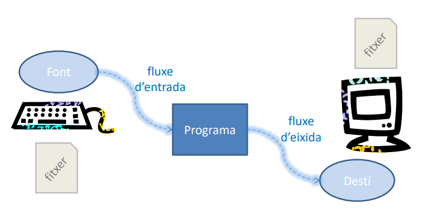

# 🔄 Entrada y Salida Elemental



### 📥 Entrada
`System.in` => entrada estándar

```java
Scanner sc = new Scanner(System.in);
```

### 📤 Salida
`System.out` => salida estándar

```java
System.out.println("Hola Mundo");
```

`System.err` => mostrar errores

```java
System.err.println("Esto es un mensaje de error");
```

---

## 1. 🖨️ `printf` en Java
Permite mostrar texto formateado en consola.

Funciona usando **marcadores de formato** (placeholders) que se reemplazan con valores.

**Sintaxis base:**

```java
System.out.printf("Hola Mundo");
```

### 🔹1.1 Formatos más comunes
<br>

| Formato | Descripción                                  | Ejemplo de uso            |
|---------|----------------------------------------------|---------------------------|
| `%d`    | Enteros (int, long...)                       | `System.out.printf("%d", 10);` |
| `%f`    | Decimales (float, double)                    | `System.out.printf("%f", 3.14);` |
| `%.2f`  | Decimal con 2 decimales                      | `System.out.printf("%.2f", 3.1416);` |
| `%s`    | Cadenas de texto (String)                    | `System.out.printf("%s", "Hola");` |
| `%c`    | Carácter (char)                              | `System.out.printf("%c", 'A');` |
| `%b`    | Booleanos (true/false)                       | `System.out.printf("%b", true);` |
| `%n`    | Salto de línea                               | `System.out.printf("Hola%nMundo");` |

<br>

💡 *Ejemplo:*
```java
public class EjemplosPrintf {
    public static void main(String[] args) {

        // %d → Entero
        System.out.printf("Tengo %d años%n", 25);

        // %f → Decimal (por defecto 6 decimales)
        System.out.printf("El precio es %f%n", 3.141592);

        // %.2f → Decimal con 2 cifras
        System.out.printf("PI con dos decimales: %.2f%n", 3.141592);

        // %s → String
        System.out.printf("Hola, mi nombre es %s%n", "Carlos");

        // %c → Caracter
        System.out.printf("La inicial es %c%n", 'A');

        // %b → Boolean
        System.out.printf("¿Es mayor de edad? %b%n", true);

        // %n → Nueva línea
        System.out.printf("Primera línea%nSegunda línea%n");
    }
}
```

<br>

---

## 2. 📝 Clase `Scanner`

Clase de Java que permite **leer datos** desde diferentes fuentes, como el teclado (`System.in`).

Se usa mucho para pedir información al usuario.

1️⃣ primero se importa:
```java
import java.util.Scanner;
```
2️⃣ y se crea así:
```java
Scanner sc = new Scanner(System.in);
```

<br>

### 🔹2.1 Métodos más comunes de `Scanner`

| Método          | Tipo de dato que lee | Ejemplo de uso                     |
|-----------------|-----------------------|-------------------------------------|
| `nextLine()`    | Texto completo (String) | `String nombre = sc.nextLine();`   |
| `next()`        | Una palabra (String)    | `String palabra = sc.next();`      |
| `nextInt()`     | Enteros                 | `int edad = sc.nextInt();`         |
| `nextDouble()`  | Decimales               | `double nota = sc.nextDouble();`   |
| `nextBoolean()` | true / false            | `boolean ok = sc.nextBoolean();`   |
| `nextFloat()`   | Decimales (float)       | `float altura = sc.nextFloat();`   |
| `nextLong()`    | Enteros largos          | `long numero = sc.nextLong();`     |

<br>

💡 *Ejemplo:*
```java
// importa
import java.util.Scanner;

public class EjemploScannerBasico {
    public static void main(String[] args) {

        // lo crea
        Scanner sc = new Scanner(System.in);

        System.out.print("¿Cómo te llamas? ");

        // se usa para almacenar datos
        String nombre = sc.nextLine();
        System.out.println("Hola " + nombre);
    }
}
```

<br>

---