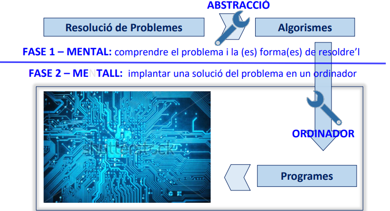

# ✅ TEMA 1. Problemas, Algoritmos y Programas

 

## 1. ¿Qué es Programar? 🖥️

**Programar** es el proceso de **resolver problemas usando un ordenador**.

Para que un ordenador pueda resolver algo, primero necesitamos decirle **cómo hacerlo**. Ahí entra el concepto de **algoritmo**.

 

## 2. Algoritmo 🔄

Un **algoritmo** es una secuencia de pasos (acciones) que debes seguir para resolver un problema.

💡 **Ejemplo:**  
Para hacer un café:
1. Calentar agua  
2. Poner café en el filtro  
3. Echar el agua  
4. Servir en la taza

Eso es un algoritmo, simplemente no en código.

 

## 3. Procesador ⚙️

El **procesador** es una entidad (normalmente una máquina) capaz de ejecutar las acciones que le indiques.

**Puntos importantes:**

- Cada procesador tiene su propio **lenguaje** o conjunto de instrucciones (por ejemplo, una CPU, una impresora 3D o un robot).  
- El programador debe conocer **qué acciones puede ejecutar** ese procesador para darle instrucciones correctas.

💡 **Ejemplo:**  
No le puedes pedir a una calculadora que reproduzca música porque no tiene esa capacidad.

 

## 4. Fases y Herramientas de la Programación ✅

Programar no es solo escribir código. Se divide en dos grandes fases:

 

### ✏️ FASE 1 – MENTAL

Se centra en **pensar y planificar la solución**.

**Herramienta principal:** Abstracción

¿Qué es abstraer? Es simplificar y organizar el problema. Incluye:

- **Descomponer** el problema en partes más pequeñas (subproblemas).  
- **Relacionar** esos subproblemas entre sí.  
- **Detectar** si alguno ya tiene una solución conocida o un algoritmo previo.

💡 **Ejemplo:**  
Si quieres hacer una app de notas:  
- Subproblemas: crear una nota, guardarla, eliminarla, mostrarla.  
- Algunos ya sabes cómo resolverlos (por ejemplo, guardar datos).

 

### 🛠️ FASE 2 – METAL

(“Metal” = llevarlo al ordenador)

Consiste en **implantar la solución** en un ordenador.

**Herramienta principal:** Ordenador  
Formado por:  
- **Hardware** (la parte física)  
- **Software** (los programas)

El ordenador **amplifica nuestra capacidad mental**: lo que antes era una idea, ahora se convierte en algo que se ejecuta.

💡 **Ejemplo:**  
Pensar cómo ordenar una lista (fase mental) → escribir el código que lo hace (fase metal).

 

 

---
