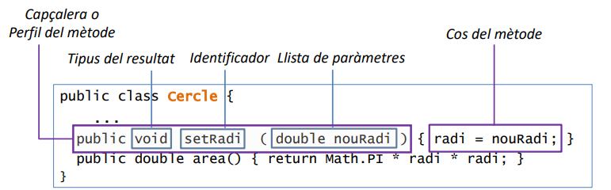
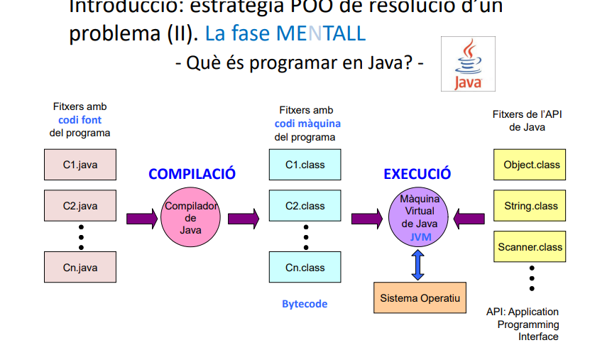

# TEMA 2. Objetos, Clases y Programas

<br>

## 1. Objeto 📦 
Agrupación de datos y acciones entre sí

- los datos se llaman __atributos__ 

- las acciones se llaman __métodos__

<br>

💡 *Ejemplo:*
<br>
imagina que representaras un perro en un programa:

- datos (atributos): nombre, raza, edad

- acciones (métodos): ladrar(), comer(), dormir()

<br>

---

## 2. Clase 🧩 
Es como el _molde_ o la _plantilla_ que se usa para crear objetos

<br>

💡 *Ejemplo:*
<br>
retomando el ejemplo del perro, una clase no sería un perro en sí, sino la __definición general__ de lo que es 

<br>

Clase: ``Perro``
<br>
Objetos: ``perro1``, ``perro2``, ``perro3``

<br>

## 2.1. Tipos de clases en Java

Las clases en Java se pueden clasificar según **cómo se usan** y según **quién las crea**.


### 🔹 2.1.1. Según su estructura y uso

#### 🟦 Clase **Tipo de datos**
Se usa para **definir objetos**. Dentro se codifican:
- Los **atributos** (datos del objeto)
- Las **operaciones o métodos** que actúan sobre esos datos

💡 *Ejemplo:*  
```java
class Coche {
    String color;
    int velocidad;

    void acelerar() { ... }
    void frenar() { ... }
}
```
Esta clase permite crear objetos como ``Coche miCoche = new Coche();``

<br>

#### 🟦 Clase **Programa**
Son las únicas que **se ejecutan directamente**. 
<br>
Normalmente tienen métodos ``static`` y no se crean objetos de ellas

💡 *Ejemplo:*  
```java
public class App {
    public static void main(String[] args) {
        System.out.println("Hola!");
    }
}
```
Si no tiene ``main``, no puede inciarse la ejecución.

<br>

#### 🟦 Clase **de Utilidades**
Sirve como un **almacén de funciones**. 
<br>
Normalmente tienen métodos ``static`` y no se crean objetos de ellas

💡 *Ejemplo:*  
```java
public class Matematicas {
    public static int sumar(int a, int b) {
        return a + b;
    }
}
```
Se usaría así: ``Matematicas.sumar(3, 5)``

<br>

### 🔹 2.1.2. Según el autor

#### ✅ Tus propias clases
Las que tú escribes en tu proyecto

#### ✅ Clases predefinidas (de Java estándar)
Vienen en las bibliotecas estándar de Java

💡 *Ejemplo:* ``String``, ``Scanner``, ``ArrayList``

#### ✅ Clases de terceros
Clases hechas por otras personas, liberías externaas, frameworks, etc.

💡 *Ejemplo:* ``Gson``, ``JUnit``, ``Spring``, ``Apache Commons``

<br>

## 2.2. Estructura básica de una clase

### 🔹 2.2.1. Bloques

- __Java__ es un lenguaje orientado a bloques (unidades de código).  
- **Delimitadores:**  
  - `{` : inicio del bloque  
  - `}` : fin del bloque

- **Características de un bloque:**  
  1. Puede contener **cero o más instrucciones**.  
  2. Las instrucciones van **separadas por `;`**.  
  3. Se ejecutan **una tras otra**, en orden.  
  4. Sirve para organizar el código y poder usar varias instrucciones donde normalmente se espera una sola.

  💡 **Ejemplo:**
  ```java
    public class Ejemplo {
    public static void main(String[] args) {
        // Inicio del bloque del método main
            {
                int a = 5;   // primera instrucción
                int b = 3;   // segunda instrucción
                int suma = a + b;  // tercera instrucción
                System.out.println("La suma es: " + suma); // cuarta instrucción
            } // fin del bloque
        }
    }
    ```

<br>

### 🔹 2.2.2. Modificadores

``private`` => exclusiva del objeto e inaccesible fuera de la clase

``public:`` => accesible desde fuera de la clase 

<br>

### 🔹 2.2.3. Atributos

__Información__ propia de cada clase, declaradas como un tipo de datos determinado

<br>

### 🔹 2.2.4. Métodos

Definen las operaciones que pueden aplicar sobre los objetos de la clase.
<br>



<br>

#### Tipos de métodos

Definen las operaciones que pueden aplicar sobre los objetos de la clase.

``Constructores`` => crean el objeto e inicializan sus atributos
```java
public class Persona {
      String nombre;
      int edad;

      // Constructor
      public Persona(String nombre, int edad) {
          this.nombre = nombre;
          this.edad = edad;
      }
  }
```

``Modificadores`` => alteran el estado del objeto, cambiando valores de los atributos

```java
public void cambiarEdad(int nuevaEdad) {
    this.edad = nuevaEdad;
}

// Uso
p.cambiarEdad(26);
```


``Consultores`` => devuelve valor de los atributos de un objeto

```java
public int obtenerEdad() {
    return this.edad;
}

// Uso
int edadActual = p.obtenerEdad(); // devuelve 26
```

<br>

💡*Ejemplo más común de método:*
<br>

__método main:__
- marca _punto de incio_ de ejecución del programa
```java
public class NomDeLaClasse {
    public static void main(String[] args) {
...
    }
}
```

<br>

---

## 3. Instancia 🪄
Cuando creas un objeto a partir de una clase

💡 *Ejemplo:*
```js
Perro miPerro = new Perro();
```

aquí ``miPerro`` es una instancia (un objeto) de la clase ``Perro``

<br>

---

## 4. Operadores 🧶

### 4.1 New
se usa para crear un objeto de clase

```js
Perro miPerro = new Perro();
```

### 4.2 Operador punto
Selecciona el atributo o método que quieras

```java
// método
public void ladrar() {
    System.out.println(nombre + " está ladrando");
}

// aplicación del método
miPerro.ladrar();
```

<br>

---

## 5. Errores de compilación y ejecución en Java
### 🧭 Orden real del proceso en Java

1️⃣ **Escribes el código** → `.java`  
2️⃣ **Compilas** → se genera `.class`  
3️⃣ **Ejecutas** → la JVM corre el programa

### ❗¿Cuándo aparece cada tipo de error?

🔹 **Errores de compilación**  
Aparecen **al intentar compilar**, antes de que se genere el archivo `.class`.

🔹 **Errores de ejecución**  
Surgen **después de compilar**, cuando el programa ya se está ejecutando.

<br>

---

## 6. Organización de clases Java en librerías (packages) 📘
- Un paquete (package), es como una __carpeta__ en donde guardas clases
- Facilita la organización y el uso de las clases ya definidas y nuevas

<br>

---

## 7. Herencia. Jerarquía de clases Java  🧬 
### ✅ ¿Qué es la herencia?
Es un mecanismo que permite **crear nuevas clases** a partir de otras ya existentes, reutilizando su código.

Una clase nueva puede:
- **Extender** (añadir funcionalidades)
- **Restringir o modificar** lo que hereda

💡 *Ejemplo rápido:*  
Si tienes una clase `Animal`, puedes crear `Perro` y `Gato` heredando de ella.

### ✅ Relación jerárquica
La herencia crea una **jerarquía de clases**:
- La clase hija (subclase) hereda las características de la clase padre (superclase)
- La hija puede especializarse o refinarse

👉 *Un perro es un tipo de animal, pero con detalles propios.*

### ✅ Jerarquía en Java
Todas las clases en Java están organizadas jerárquicamente.  
La clase más básica y común a todas es:

**`Object`**

Es la **superclase de todas las clases** del lenguaje.

```java
// Clase padre (superclase)
class Animal {
    void comer() {
        System.out.println("El animal está comiendo");
    }
}

// Clase hija (subclase) que hereda de Animal
class Perro extends Animal {
    void ladrar() {
        System.out.println("El perro está ladrando");
    }
}

public class Main {
    public static void main(String[] args) {
        Perro miPerro = new Perro();

        miPerro.comer();   // Heredado de Animal
        miPerro.ladrar();  // Propio de Perro
    }
}

```

<br>



<br>

---


