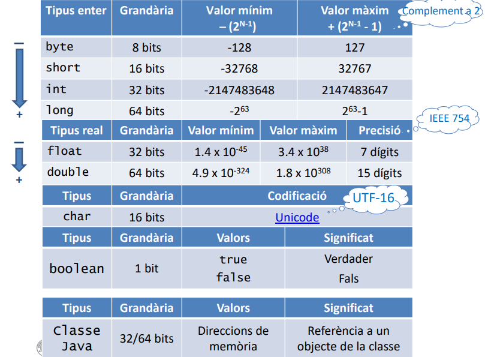

# Tema 3. Variables: Definición, tipos y uso en Java

## 1. Variables en programación
Las **variables** son espacios en memoria donde guardamos información (datos, resultados, etc...) para usarla durante la ejecución de un programa.

### 🔹1.1 Tipo de dato
Cada variable debe tener un **tipo**, que determina:
- Los **valores** que puede almacenar
- El **espacio en memoria** que ocupa y su formato
- Las **operaciones** que se pueden realizar con ella

💡 *Ejemplo:*  
```java
int edad = 20;     // solo admite números enteros
String nombre = "Ana";  // solo texto
```

<br>

### 🔹1.2 Definición de variables
Una variable siempre debe definirse antes de usarse

💡 *Ejemplo:*  
```java
int x;        // definir
x = 5;        // usar
```

<br>

### 🔹1.3 Ámbito (scope)
Parte del programa donde una variable **existe** y puede **usarse**

💡 *Ejemplo:*  
```java
public class Ejemplo {
    int global = 10;  // variable de clase (accesible en toda la clase)

    public void metodo() {
        int local = 5;  // variable local (solo dentro de este método)
    }
}
```

<br>

---

## 2. Variables según rol y ámbito de definición  🔑 

### 🔹2.1 Variables o Atributos de instancias
- **Pertenecen a cada objeto creado**.
- Cada objeto tiene su **propia copia** de esos atributos.
- Se accede con el nomnre del objeto (`objeto.atributo`)

💡 *Ejemplo:*
```java
class Perro {
    String nombre;   // atributo de instancia
}

Perro p1 = new Perro();
p1.nombre = "Toby";

Perro p2 = new Perro();
p2.nombre = "Luna";

System.out.println(p1.nombre); // Toby
System.out.println(p2.nombre); // Luna
```

<br>

### 🔹2.2 Variables o Atributos de clases
- **Son comunes a todos los objetos**.
- Solo existe una **única copia**, compartida por toda la clase.
- Se accede con el nombre de la clase (`Clase.atributo`).

💡 *Ejemplo:*
```java
class Perro {
    static int contador = 0;  // atributo de clase
    
    Perro() {
        contador++;
    }
}

System.out.println(Perro.contador); // 2 (común para todos)
```

<br>

### 🔹2.3 Variables locales
- Se definen **dentro** de un método.
- Solo existen y son accesibles dentro de ese método.

💡 *Ejemplo:*
```java
class Ejemplo {
    void metodo() {
        int x = 10;   // variable local
        System.out.println(x);
    }
}
```

<br>

### 🔹2.4 Parámetros
- Son los **datos que recibe un método** al ser llamado.
- Solo son accesibles dentro del método.

💡 *Ejemplo:*
```java
class Calculadora {
    int sumar(int a, int b) {  // a y b son parámetros
        return a + b;
    }
}
```

<br>

---

## 3. Variables según los tipos de datos 🗂️

### 🔹3.1 Tipos primitivos (básicos) 
- No se definen a partir de otros
- Su representación y operaciones. **vienen dadas** por el propio lenguaje de programación.

💡 *Ejemplo:*  
```java
int edad = 25;       // número entero
double precio = 9.99; // número decimal
boolean activo = true; // verdadero/falso
```

<br>

### 🔹3.2 Tipos de referencia (complejos o estructurados)
- Se construyeron **agrupando datos**, ya sean del mismo tipo o diferentes.
- Pueden ser:
    - **Predefinidos** (del lenguaje o sus librerías)
    - Definidos **por el usuario** (clases que tú creas)
- Una variable de este tipo **no guarda el valor en sí**, sino una **referencia** (una "dirección") al objeto en memoria.

💡 *Ejemplo:*  
```java
String nombre = "Ana";       // tipo predefinido
int[] numeros = {1, 2, 3};   // array (estructura)
Perro p = new Perro();       // tipo definido por el usuario
```

<br>

---

## 4. Tipos de datos



<br>

```java
byte edad = 25;  // números enteros pequeños (-128 a 127)

short año = 2023;  // números enteros medianos (-32k a 32k)

int poblacion = 500000;  // enteros grandes (el más usado por defecto)

long distancia = 12345678900L;  // enteros muy grandes (lleva L al final)

float pi = 3.14f;  // decimales con 7 cifras de precisión (lleva f al final)

double precio = 19.99;  // decimales con 15 cifras de precisión (por defecto para decimales)

char letra = 'A';  // un solo carácter (lleva comillas simples)

boolean activo = true;  // valores lógicos: true o false

String nombre = "Ana";  // cadenas de texto (objeto, no primitivo)
```

<br>

### 4.1 Operadores aritméticos

|Operador|Operación|
|--------|-----------|
| **+** | Suma o signo|
| **-** | Resta o signo | 
| * | Multiplicación |
| / | División |
| % | Módulo |

<br>

> ⚠️ **Atención**
>
> • Dividir un número entero entre cero genera un **error** y detiene el programa.  
> • Dividir un número decimal entre cero **no genera error**; el resultado puede ser `Infinity`, `-Infinity` o `NaN`.

<br>

### 4.2 Desbordamiento
- Ocurre cuando un número **excede el rango** que puede almacenar un tipo de dato. 
- En Java, cada tipo numérico (`byte`, `short`, `int`, `long`, `float`, `double`) tiene un límite máximo y mínimo. 
- Si intentas almacenar un número fuera de rango, el valor da la vuelta y cambia a un valor inesperado

💡 *Ejemplo con `int` en java:*
```java
public class Desbordamiento {
    public static void main(String[] args) {
        int max = Integer.MAX_VALUE; // 2147483647
        System.out.println("Valor máximo: " + max);
        
        int resultado = max + 1; // Desbordamiento
        System.out.println("Después de sumar 1: " + resultado);
    }
}
```

Salida:
```java
Valor máximo: 2147483647
Después de sumar 1: -2147483648
```

<br>

### 4.3 Secuencias de escapada

|Secuencia de escapada|Descripción|
|--------|-----------|
| ``\t`` | Tabulador|
| ``\n`` | Salto de línea | 
|``\'`` | Comas simples |
| ``\"`` | Comas dobles |
| ``\\`` | barra invertida |

<br>

### 4.4 Operandos tipo boolean
|Operador|Operación|
|--------|-----------|
| ``==`` | Igual|
| ``!=`` | Distinto | 
|``>`` | Mayor que |
|``>=`` | Mayor o igual que |
| ``<`` | Menor que |
| ``<=`` | Menor o igual que |

💡 *Ejemplo de **bucle** usando boolean (contador del 0 al 10):*

```java
if (contador > 10) {
    seguir = false;
}
```

<br>

### 4.5 Operadores Lógicos
|Secuencia de escapada|Descripción|Significado|
|--------|-----------|-----------|
| ``!`` | NOT|negación lógica|
| ``&`` | AND |conjunción o 'y' lógica| 
|| OR | disyunción u 'o' lógico|
| ``^`` | Comas dobles ||
| ``&&`` | AND curtcircuit |Si el primer operando es falso, el segundo ua no se evalu|
| ``||`` | barra invertida ||

<br>

---

